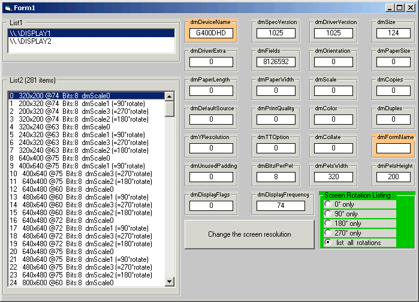

## Change Screen Resolution \(2nd monitor\)

### Description

This project demonstrates how to change the screen resolution of the second screen. Searchterms: EnumDisplaySettings, ChangeDisplaySettingsEx, ChangeDisplaySettings, ScreenRotation, Screen Rotation, Rotate, Second Display, Second Monitor, DisplaySettings, DisplaySetting, Display Setting, Display Settings
 
### More Info
 

             |
---                |---
**Submitted On**   |2011-03-28 14:10:02
**By**             |[vb\_elmar](https://github.com/Planet-Source-Code/PSCIndex/blob/master/ByAuthor/vb-elmar.md)
**Level**          |Intermediate
**User Rating**    |4.0 (8 globes from 2 users)
**Compatibility**  |VB 5\.0, VB 6\.0
**Category**       |[Windows API Call/ Explanation](https://github.com/Planet-Source-Code/PSCIndex/blob/master/ByCategory/windows-api-call-explanation__1-39.md)
**World**          |[Visual Basic](https://github.com/Planet-Source-Code/PSCIndex/blob/master/ByWorld/visual-basic.md)
**Archive File**   |[Change\_Scr2200883282011\.zip](https://github.com/Planet-Source-Code/vb-elmar-change-screen-resolution-2nd-monitor__1-73810/archive/master.zip)

